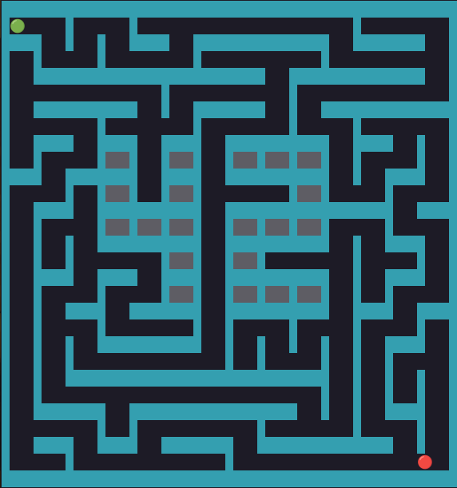
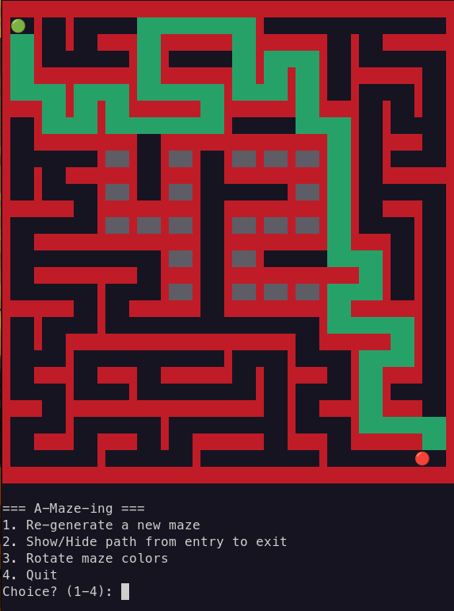

# 🏛️ A-Maze-ing

### *Turning randomness into structure, one wall at a time.*

---

<p align="center">

<!-- Put your screenshot here -->
## 🖼️ Gallery

### Generated Maze



### Solution Path



---

## What is this?

A maze starts as chaos.

Walls everywhere.
No direction.
No path.

Then an algorithm begins carving passages through the grid, cell by cell, until a valid maze emerges.

**A-Maze-ing** is a Python project that generates, solves, and visualizes mazes while guaranteeing consistency, reproducibility, and clean architecture.

Give it a configuration file, and it will create an entirely new labyrinth ready to be explored.

---

## ✨ What it can do

🧩 Generate random mazes

🌱 Reproduce the exact same maze using a seed

🎯 Find the shortest path from entrance to exit

🔒 Generate perfect mazes (one unique solution)

🖥️ Display the maze visually

📦 Export the maze using hexadecimal wall encoding

4️⃣2️⃣ Draw a visible **42** pattern directly inside the maze

---

## Behind the Walls

Every maze is represented as a grid.

Each cell knows whether its:

* North wall exists
* East wall exists
* South wall exists
* West wall exists

Using only four bits, an entire labyrinth can be described.

Example:

```text
1111
```

A completely closed cell.

```text
0101
```

Open in some directions, blocked in others.

Simple representation.
Complex worlds.

---

## The Architect

### Recursive Backtracker (DFS)

The maze is built using a depth-first search approach.

Starting from a single cell:

1. Choose a random neighbour
2. Remove the wall between them
3. Move forward
4. Repeat
5. Backtrack when trapped

The result is a maze that feels natural, connected, and fun to solve.

Why this algorithm?

Because it creates:

* Long corridors
* Interesting dead ends
* Perfect mazes
* Fast generation times

---

## The Explorer

### Breadth-First Search (BFS)

Once the maze exists, it must be solved.

BFS explores every reachable path layer by layer until it reaches the exit.

Because of that, the first solution found is always the shortest possible one.

No guessing.
No luck.
Just mathematics.

---

## 🗂️ Project Layout

```text
.
├── a_maze_ing.py
├── config.txt
├── README.md
├── Makefile
├── pyproject.toml
│
├── mazegen/
│   └── mazegen.py
│
└── output_maze.txt
```

---

## 🚀 Running the Project

Install dependencies:

```bash
make install
```

Run:

```bash
make run
```

or

```bash
python3 a_maze_ing.py config.txt
```

---

## ⚙️ Configuration

A maze begins with a simple text file.

```text
WIDTH=20
HEIGHT=15

ENTRY=0,0
EXIT=19,14

OUTPUT_FILE=maze.txt
PERFECT=True

SEED=42
```

Change the values.

Generate a new world.

---

## 📤 Export Format

The generated maze is written using hexadecimal digits.

Each digit stores the state of the four walls:

| Bit | Direction |
| --- | --------- |
| 0   | North     |
| 1   | East      |
| 2   | South     |
| 3   | West      |

This compact representation allows large mazes to be stored efficiently while preserving every wall.

After the maze data, the file also contains:

* Entry coordinates
* Exit coordinates
* Shortest valid path

---

## 🖥️ Visual Mode

The maze can be explored directly from the terminal.

Available actions:

* Generate a new maze
* Show or hide the solution
* Change wall colors
* Highlight the embedded 42 pattern

Every run creates a different challenge.

Unless, of course, you keep the same seed.

---

## What I Learned

This project is much more than drawing walls.

It combines:

* Graph Theory
* Pathfinding
* Randomized Algorithms
* Data Encoding
* Software Architecture
* Python Packaging

Most importantly, it shows how a collection of simple rules can create something that feels unexpectedly alive.

---

> "A maze is not built to trap you.
> It is built to challenge the way you think."
